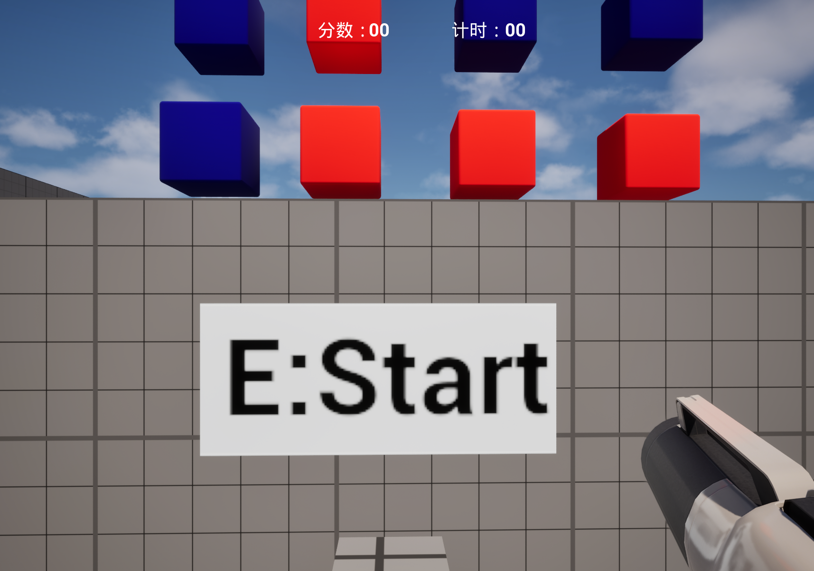
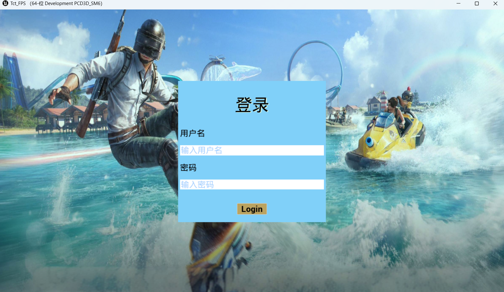
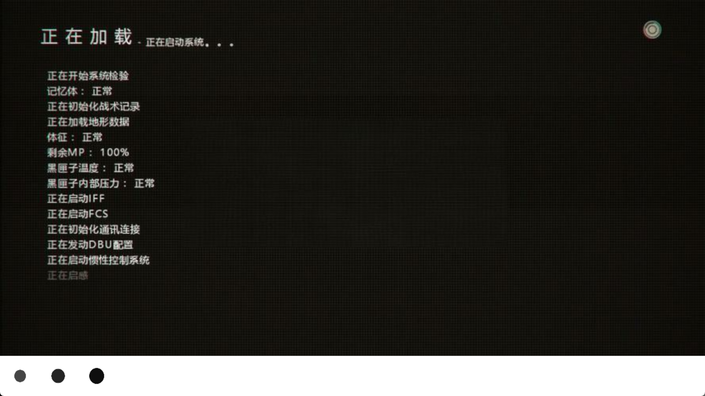
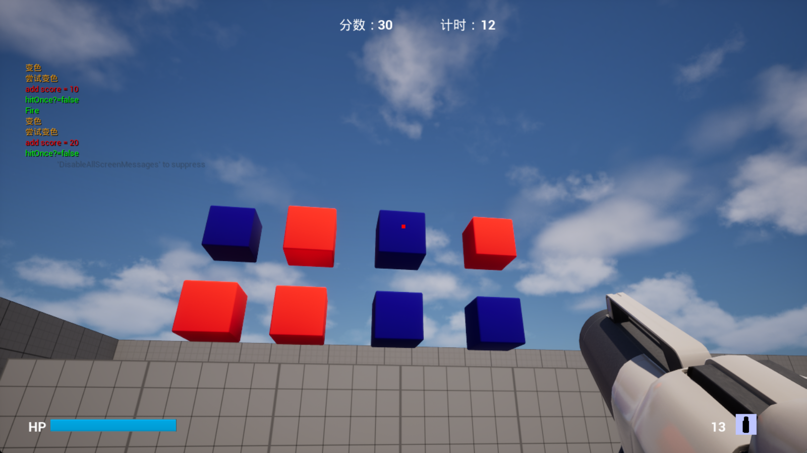

# 第一节课作业：
## 编译UE5源码

## 将FPS模板打包为安卓包

# 第二节课作业:
## 任务1物件效果:箱子被击中后设置碰撞体Scale,调用GameMode的AddScore()
## 任务2游戏流程:GameMode在开始游戏后随机选择几个箱子调用MakeImportant(),将其置为红色.然后开始计时,计时回调打印分数.

## 从配置读取变量值

# 第三节课作业:
## 完成第二节附加题UI：增加了开启射击挑战的3D Widget、显示积分倒计时的HUD

# 第四节课作业:
## 任务1：登录界面，输入框设置为密码

## 任务2：加载界面，使用插件AsyncLoadingScreen，设置背景图和LoadingWidget

## 任务3：HUD增加血条；增加子弹数，开火后减1；增加准星，命中后变红,持续0.5s

